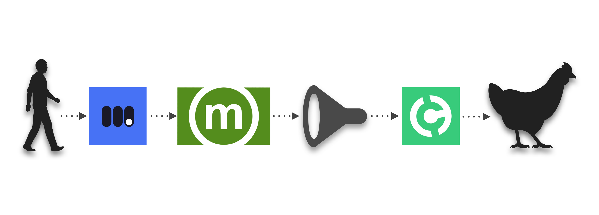

# Memochicken

Post a memo, feed the chicken.


> This project is a remix of an already-really-cool project set up by [Spencer Lambert](https://twitter.com/SpencerLambert), which lets you pay bitcoin cash to feed chickens.
>
> What this project does in addition is let you send a personal message to the chickens alongside your ration airdrop.

Feeding the chickens is cool but, what if you could add personal messages to the food? That will surely warm the hearts of all the chickens instead of not knowing who the secret donor is.

Well worry no more! Now you can send a very personal message along with the food, powered by Memo!



Here's how it works.

1. **Moneybutton:** Construct a BCH transaction using [Moneybutton](https://moneybutton.com)
2. **Memo.cash:** The transaction is a Memo.cash post (0x6d02) with a hashtag "#memochicken" as described at https://memo.cash/protocol
3. **Bitsocket:** Memochicken has a relayer server daemon component that uses [Bitsocket](https://bitsocket.org) to monitor the blockchain, ONLY to listen to `0x6d02` transactions that make a payment to the relayer server's bitcoin address.
4. **Handcash:** When a relevant Bitsocket event comes in, the Memochicken relayer looks to see if the amount is more than 50cents. If it is, it creates an additional transaction to tha [Handcash](https://handcash.io) handle `$chicken` and broadcasts it.
5. **CryptoCandy:** The [Crypto Candy Machine](https://www.iozeta.com/product/cryptocandy/) set up by [Spencer Lambert](https://twitter.com/SpencerLambert) dispenses chicken feed. Chickens overcome hunger.
6. **Twitch:** The `$chicken` handle is being livecasted on Twitch at https://www.twitch.tv/redpepper261. This app embeds the Twitch stream to provide a single page all-in-one experience.

# Why the complexity?

## 1. Why Moneybutton?

The [Memo.cash](https://memo.cash) website doesn't have a way to natively attach funds to each message. But guess what? There's a loophole. Since every post is a transaction, you can attach another output to every Memo.cash message. 

You can do this by building a 3rd party Memo app like Memochicken and inheriting Memo.cash protocol but attaching additional Bitcoin transaction outputs. (I use the [datacash](https://github.com/unwriter/datacash) for server-side transactions and [databutton](https://github.com/unwriter/databutton) for the client-side to incorporate Moneybutton.

This means you can do all kinds of things on top of Memo, such as sending money (**NO change to the Memo protocol needed!**)

## 2. Why Bitsocket?

[Bitsocket](https://bitsocket.org) is the core glue that puts everything together. Bitsocket the realtime API for bitcoin, built with 100% open web technologies such as SSE (Server Sent Events). It lets you subscribe to all kinds of transaction patterns using a Turing complete Bitcoin query language called [Bitquery](https://docs.bitdb.network/docs/query_v3)

Here's the bitsocket query that listens to all the Memo.cash post transactions with a hashtag "#memochicken", and transforms the transaction into a custom push notification.


You can learn more about bitsocket [here](https://bitsocket.org)

```
{
  "v": 3,
  "q": {
    "db": ["u"],
    "find": {
      "out.h1": "6d02",
      "out.s2": {
        "$regex": "#memochicken", "$options": "i"
      },
      "out.e.a": process.env.address
    }
  },
  "r": {
    "f": "[.[] | .tx.h as $tx | .out[] | select(.b0.op? == 118) | { output: ., tx: $tx } ]"
  }
}
```

Whenever a new push notification event is triggered, the Memochicken daemon automatically compares the incoming amount with the amount it's supposed to send to the chickens (50 cents). 

If it's above 50 cents, then the daemon is ready to send the food. It makes a request to the [Handcash API](https://handcash.io/api-docs/) to fetch the receiving address for the `$chicken` handle, and then sends the food.

# Memochicken is an Autonomous Program

Memochicken adds a slight fee (1 cent) to the transactions so that it can sustain itself in the long term. The balance will never become lower than 0 and the general idea is that the constant influx of revenue will be enough to sustain itself.

> Just to be clear, the intention of Memochicken app itself is NOT to make money. It's for making a point how an autonomous self-sustaining program can work on bitcoin.

**Essentially, Memochicken is an example of an autonomous bitcoin application that can survive on its own, using bitcoin as the energy source.**
